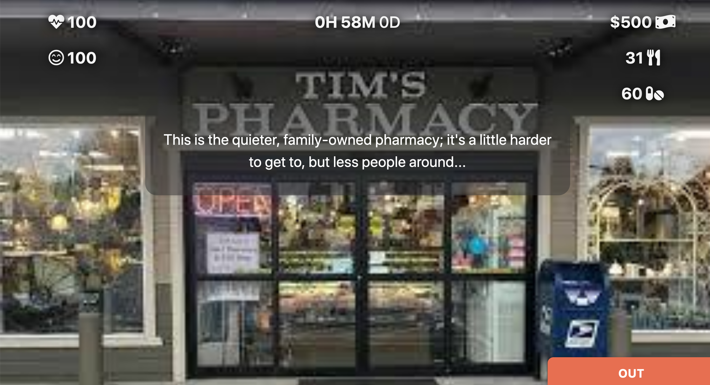
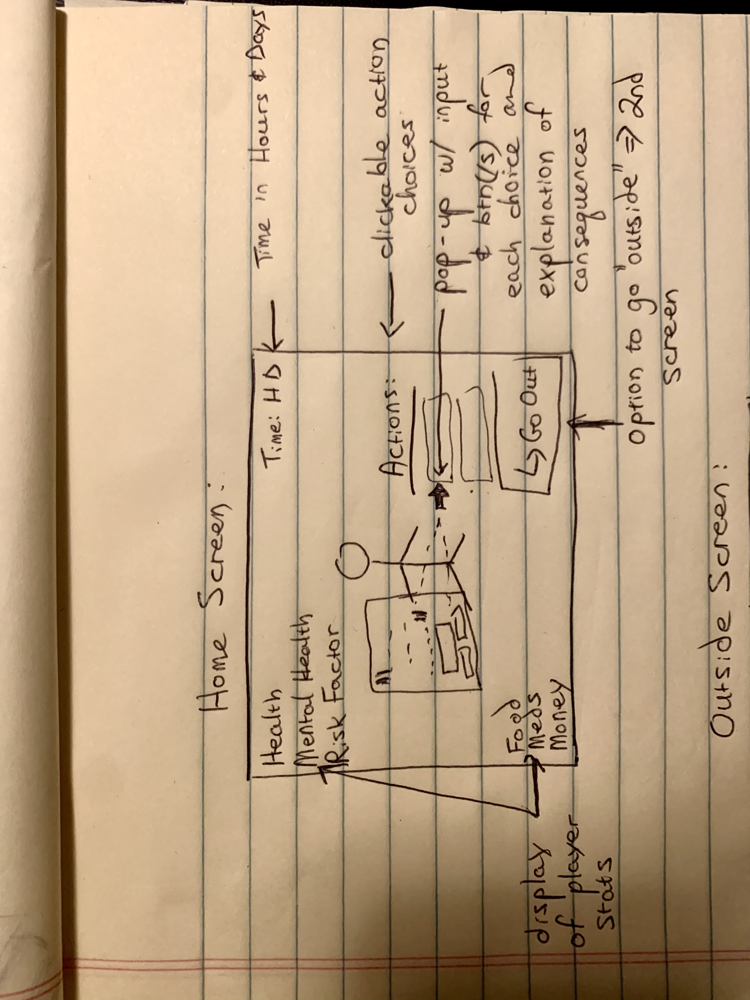
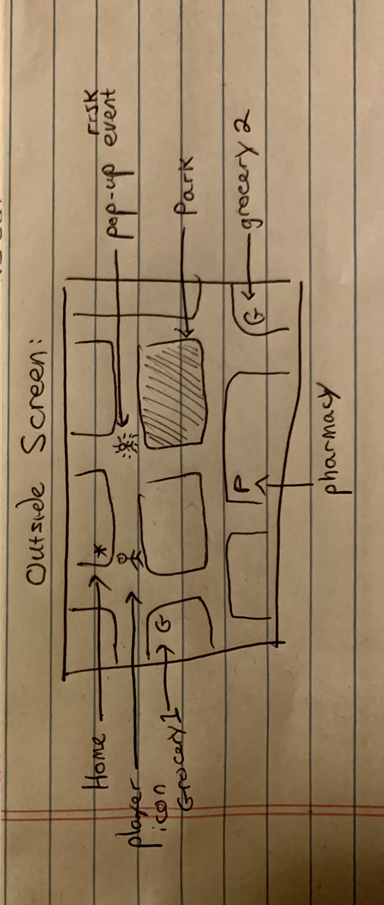
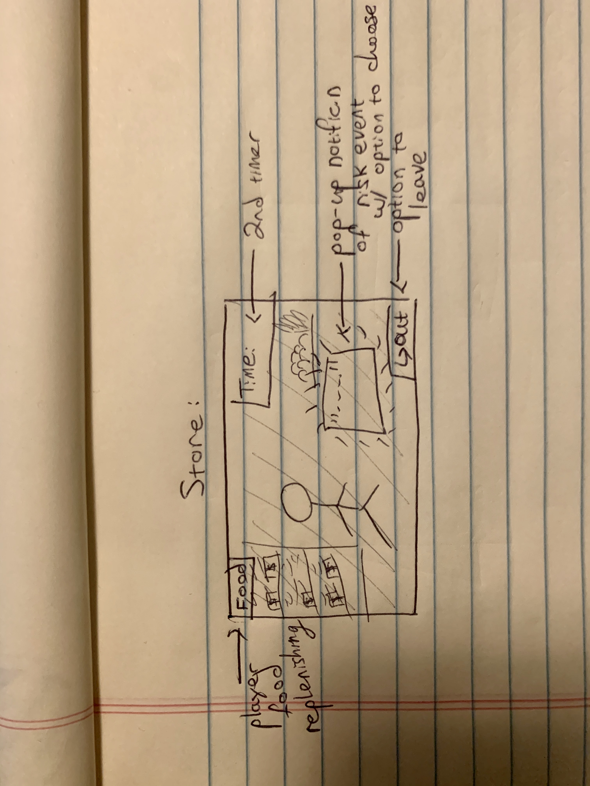

## Avoid COVID Game:

### Developer Objective:

> - Educate people on risk factors
>
> - Say something about resources and opportunity disparities and their effects on covid risk

### Game Rules:
#### Welcome to the Avoid Covid game:
##### where survival is a virtue and everyone's a sinner

#### Here are the rules (in case you're still hoping to win 😂):

- You start with 100 Health and Mental Health, and some Food, Meds, and Money  

-  If you stay home you won't run into any risks, but your Mental Health will go down
-  Your Food and Meds are constantly going down and you need to go to the store and spend Money to refill them
-  You can make more Money by going to the work place; but beware, it costs you Health and Mental Health...
-  If your Food runs out, your Health starts going down fast
-  You can replenish your Mental Health by going to the park and your Health by staying home if your meds are mostly full
-  If your Health or Mental Health reach zero you lose...
  
#### Now the fun part: random risks outside the home

- On the street, people with varying risk to you will randomly show up; if they happen to be near you, you'll see them:

  - You'll see a pop up describing the person and a set of choices:
  
  - You can run away: you don't get any virus exposure, but you have to walk around them now... and your caution goes down, so they'll come at you just a little more frequently now...
  - You can keep on going: you'll risk getting some virus exposure depending on what the risk person decides to do... good luck
- Different acts make different amounts of virus: (e.g. a cough makes much more virus than a yell); and the conditions matter: were they covering their mouth?, was the wind blowing?, etc.
- You can only take a certain amount of exposure within a small amount of time: if you get a little exposure, wait a long time, and then another little, you won't catch it; but if you get a whole lot at once, or several little amounts one after the other, you catch it
- How much exposure you can take depends on your health and mental health (if you're very sick or stressed, it's easier for you to catch it)
- You can only run away from one person; if there are two people near you, you must choose which one to expose yourself to
- Inside environments (STORES) have different frequency of pop ups and the risks are bigger (an inside cough doesn't get blown away by the wind), so be careful inside! Someone who wouldn't pose a risk outside CAN inside
- Stay in stores only as long as necessary!
- Last note: if you're home and your Mental Health is not low, your caution will SLOWLY replenish

#### That's all! Go!!! Have fun! Live! 😂😂😂
##### Oh, I almost forgot: if you make it to 48H you win, not that I have any hope you'll get there...


### User Stories: 
 * I want to be able to see the status of my gamerep's health, food, etc AND to have it be noticeable when it goes down or up
 * I want to get feedback when I make a choice telling me what the result of that was and what my status is now and maybe hint to me what further options I have after that
 * I want to be able to tell how my person is moving on the outside board, not too fast but also not so slow that it's painful to control
 * I don't want to make any game choices by mistake; i.e. leave the store or go in by pressing accidentally
 * I want to know how well I'm doing so I can adjust my choices: maybe include reminders if things are getting bad and color code stats display

### Minimal Viable Product
- Has 3 interaction contexts:
1. **Home:** 
   - Display:
     - pic representing player with player name
     - Time (H and D), Health, Mental Health, Food, Money, (maybe Risk Factor, time since last exposure, Caution)
  
   - Action Choices:
     - Exercise
     - Talk/text/zoom?
     - (food goes down automatically)
     - ( maybe drink, eat ice-cream, watch tv)
     - Go out: 
       - choice: what to wear (protective)

  1. **Outside:**
     - Display/Action:
  
       - street grid layout (inspo: pokemon, police quest) 
       - Icon representing player with movement in grid controlled by on-screen elements for mobile and (also by keyboard arrows for desktop - not crucial): REQUIRE response on screen to show direction element clicked
       - random generated pop up events
       - display to player about type of risk event AND option to choose response
       - preset consequences based on risk AND using playerStats (risk factor, exposure time, caution, etc.): calculate and record internally and show to player where appropriate
       - Option to enter 3rd context: grocery/workplace/pharmacy/park/indoor cafe/etc. ONLY grocery and maybe workplace essential for MVP
  
   1. **Non-home contained settings "space":** 
       - Display/Activity:
         - Non-interacting place background pic
         - random generator tied to time in store/park
         - pop-up risk events with option to choose
         - replenishment of playerStats based on time there: longer is better
         - option to leave at any time
         - second zoomed in time counter for time in this space

### Stretch game features: 
- Home page action choices
 - Choice of "difficulty" before start opens different posssiblities: 
   - work from home
   - order food by app
   - etc
 - Work choices: 1st stretch feature to tackle
   - work to make money: choice of how hard to work: earnings vs risk
- Dark mode

### Pseudocode:
```
scaffolding: 

player object holds stats: 
visible: food, money, meds, health, mental health
hidden: exposure, caution
toggles: winLose, context (in or out)

-and methods closely tied to player stats like:
expose, reverseAfterTime (tracker), getFatDepressed (stats incrementor), riskFactor getter, and check for loses

class Incident defines incidents like cough, sneeze, spit, etc: giving the appropriate rendering strings and the numbers to calculate exposure

class RiskEvent encapsulates person posing risk and includes description, incidents possible and probability factor for each (stored as objects), hit, miss, and partial hit message arrays
- and methods closely tied to the encapsulated incidents and message options

exposure pipeline:

random generator runs in loop in background

when function finds hit, internal functions are called to pause random generator, freeze player controls
AND rendering function is called to display event and options to player

player choice is then passed back to another render which sends it back to the check function, renders the result and then passes it back to internal functions to increment player stats / set win etc. 

If win/lose these functions stop the game play and throw the ball back 
  to win/loss rendering functions to display to player
  and to internal fxns to clear all trackers so nothing is still running after init

If not, they restart the player controls and random generator to continue looping...


page is split into 3 for 3 general contexts mentioned above: home, out, and space

3 divs with display none/on toggled by on screen buttons or triggers to move between contexts


Home page: btnevent listener starts init which starts up the gameTimer interval fxn
gmTimer keeps pressing player stats incrementor and then stats display and keeps repeating throught gameplay. 
Also checks for win by time lasted

Out page: random int is started to repeatedly call genZombie. This picks a random board space and if it is near player generates random RE.

Once random RE is generated, it's rendered to the board and player controls are disabled, 
further check for two nearby
and then call on render function to extract RE description and present choices

branch fxn takes player choice and implements consequences: expose if chooses to stay and caution increment if chooses to run
this then sends it on to render result, give player time to read, and then check if gameplay should proceed by sending to check

if check has no response, gameplay proceeds...
if check finds loss, play resumption and rerendering is halted and lose track is started => 

  check sends results to intermediate fxn which switches off any still running intervals and the gametimer, takes the player out of play context

  then sends the info on to win/loss render function

Out page: accessed through using the move fxn:
similar interval is started here after stopping the out pg interval. But only the RE random generator is called

Each time it calls, player controls are disabled, player is taken out of context and Render fxn is called to display RE and choices

player choice is sent to branch fxn: leave or stay
choice is sent to render and--if stay--then expose is done and result passed through to render

Render shows result of choice stay/run and then, based on choice, either starts up the game play and rerenders it again or it -- checks if exposure loss and then either back to play or on to winloss chain

rest same as before

```

### Game screenshots:




### Wireframes:





### Deployment Link:
###### [mygame]('avoidcovid.surge.sh')

### Technologies / libraries used:
- HTML, CSS, Javascript
- Font-Awesome, Materialize


  